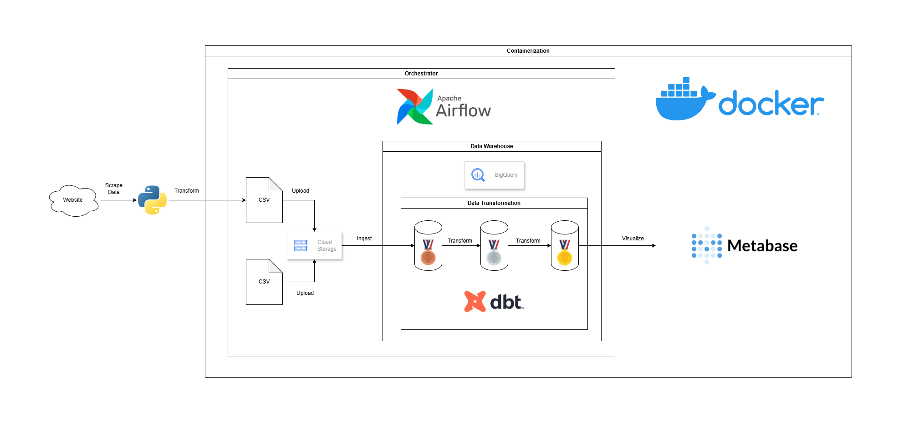

# 🚀 Comprehensive Retail Data Analytics Pipeline

## 📝 Project Overview
This project demonstrates an end-to-end Extract, Load, Transform (ELT) pipeline for online retail data. It is engineered for scalability and data quality, culminating in a highly optimized Data Warehouse for analytical reporting.

The core technology stack and architecture are centered around:

- **Orchestration**: Astro CLI (Apache Airflow)
- **Transformation**: Cosmos-DBT
- **Data Warehouse**: Google BigQuery
- **Data Quality Standard**: Medallion Architecture
- **Data Model**: Star Schema
- **Visualization**: Metabase

## 🗺️ Medallion Architecture & Star Schema Implementation
The data flow strictly adheres to the Medallion Architecture to manage data quality and maturity, while the final layer is modeled using a Star Schema for optimal BI performance.

### Medallion Architecture
|Layer (Maturity)|Description|Technology Used|
|----------------|-----------|---------------|
|🥉 Bronze (Raw)|Initial staging of raw data from sources.|GCS → BigQuery Staging|
|🥈 Silver (Cleaned & Conformed)|Data is cleaned, standardized, and validated (e.g., handling nulls, type casting) by initial DBT models.|DBT Staging Models|
|🥇 Gold (Curated & Modeled)|Final, aggregated, and optimized data. Modeled into a Star Schema with the Fact_Sales table and associated Dimensions.|DBT Mart Models|

### Star Schema

## 📚 Data Source: 
- Sales Transaction Data → https://www.kaggle.com/datasets/tunguz/online-retail
- Country Data → https://docs.dnb.com/partner/en-US/iso_country_codes

## 🛠️ Tech Stack & Roles:
|Component|Version|Role|
|---------|:-----:|----|
|Astro CLI (Apache Airflow)|1.38.1|Orchestrating the entire ELT workflow, managing DAGs, and integrating with Cosmos-DBT.|
|Cosmos-DBT |1.11.3|Handling all data transformation logic within the DAGs, applying rigorous SQL modeling, testing, and schema generation.|
|Google BigQuery|-|High-performance Cloud Data Warehouse for storing all Medallion layers and the final Star Schema.|
|Google Cloud Storage|-|Storing all raw file which will ingest to bronze layer.|
|Python|3.12.3|Custom scripting for initial extraction and data movement tasks.|
|Docker Desktop|4.51.0|Containerization for consistent and reproducible environment setup.|
|Metabase|v0.57.x|BI tool connected to the Gold Layer Star Schema for creating dynamic dashboards.|
|WSL (Ubuntu)|24.04.3 LTS (Noble Numbat)|Local Host Environment to isolated run Docker, Astro CLI, & Python|
