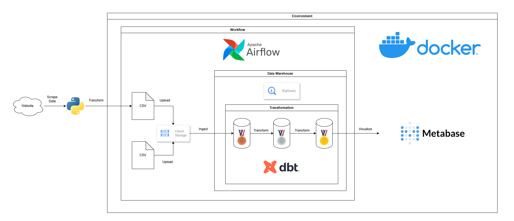

# Online Retail Analysis (ELT & Visualization)

## Project Description:
This project applies Extract, Load, Transform (ELT) with Astro CLI (Apache Airflow) as the orchestrator and DBT for data transformation. This project is using Google BigQuery as a data warehouse and Metabase to visualize the data.

## Data Source: 
- Sales Transaction Data -> https://www.kaggle.com/datasets/tunguz/online-retail
- Country Data -> https://docs.dnb.com/partner/en-US/iso_country_codes

## Prerequisite
- GCS Bucket
- GC service account with admin access to GCS and BigQuery

## Tech Stack:
- Astro CLI (Apache Airflow) : 1.38.1
- Python : 3.12.3
- Docker Desktop : 4.51.0
- Cosmos-DBT : 1.11.3
- Google Cloud Storage
- Google BigQuery
- Metabase : v0.57.x

## Project Architecture

